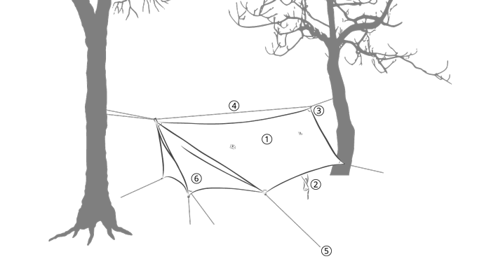
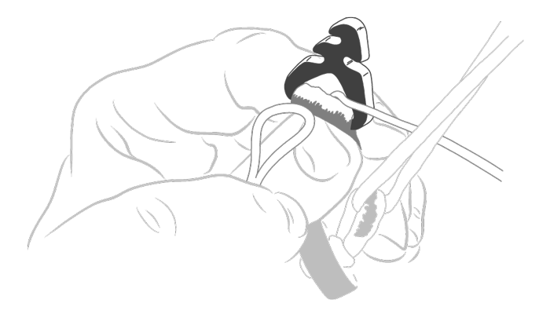
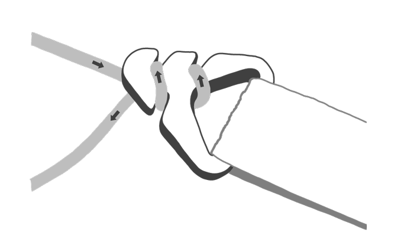
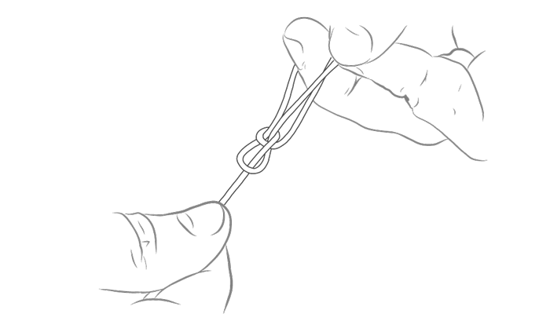

# Rain Tarp Manual

## VIDEO GUIDE

https://youtu.be/9YN_4eEpS8Y

## PARTS

1. Tarp Body
2. Stuff Sack
3. Guyline Quick Adjuster
4. Ridgeline
5. Tent Stakes (sold separately)
6. Doors (Pelican Tarp Only)

## SEAM SEALING

In order to seam seal your tarp, you will need the following items.

SilNet Seam Seal (included with your tarp)

Small disposable brush (about ¼ inch wide)

To ensure the seams are stretched and tight before applying seam seal, the tarp needs to be completely set up as you would for typical use. Return to this section after following the setup steps below.

Use the small brush or the tube to apply the silicone sealant to the center seam of the tarp. It is not necessary to seal the edges of the tarp. You can use a damp cloth to clean up any spills or drips. Allow the seam sealer to cure for at least 6 hours before use or repacking.

SilNet Seam Sealer can also be used to repair small holes and leaks in the future.

## CHECK

Inspect your tarp for any abrasions, rips and tears, or discolored areas. Pay particular attention to the guyline attachment loops and where they are sewn to the tarp, these items take the most stress during a storm.

Cut your guyline cord into suitable lengths for your typical hanging location. When using our Guyline Kit, we recommend 35ft (10.7m) for the ridgeline section, four 6ft (1.8m) sections for the door flaps (unnecessary for the Heron Tarp), and four 10ft (3m) sections for the corners. You should have about a foot of guyline left while following these recommended lengths. Leaving the tie-outs longer leaves some extra flexibility on getting around rocks and hard spots as well as accounting for sloped terrain. Please take these lengths as suggestions and use your own discrepancy when cutting your guyline to length.

Ensure you have seam-sealed your tarp before first use.

## LOCATION

Look for a spot with two sturdy trees (or other objects to attach to) that are about 12 to 15 feet apart. Be sure the trees are thick enough and healthy enough to hang from, we recommend at least 8 inches in diameter. One of the major advantages of hammock camping is not having to worry about finding a clear and flat spot for a tent. However, we still recommend not setting up over sharp rocks or at the edge of a cliff.

## RIDGELINE

> **NOTICE:** Our Quick Adjuster Hardware is non-load bearing and should never be used as a part of an adjustable load-bearing ridgeline.

Pass one end of your ridgeline length guyline cord through the triangular hole in the plastic hardware on one side of your hammock. Wrap the guyline cord around the tree once and bring it back to the same triangular hardware piece. Pass the cord through the triangular hole in the hardware and then wrap it around the “fishbone” shape of the hardware piece to create a friction lock.

## QUICK ADJUSTER HARDWARE

> **NOTICE:** Our Quick Adjuster Hardware is non-load bearing and should never be used as a part of an adjustable load-bearing ridgeline.

Follow the ridgeline of the tarp to the other end and locate the hardware piece. Repeat the steps above with the loose end of the guyline cord. Tension the tarp by pulling gently on the guyline cord while wrapping around the “fishbone” shape of the second hardware piece. Tension can be easily adjusted from either end by simply unwrapping, adjusting, and rewrapping the guyline cord around the triangular hardware piece.

> You have the option of running your guyline the length of the tarp's ridgeline (a continuous ridgeline - described above and pictured in Image 1) or tying a shorter length of guyline from each end of the tarp to each tree (a two-line tarp suspension). It can be convenient to use a continuous ridgeline as you can quickly slide the tarp into place. However, a two-line suspension is less complicated and our Quick Adjuster hardware enables you to forgo pesky knots and metal hardware. We suggest customizing your setup to your own needs.

## CORNER TIE-OUTS

Tie the shorter lengths of guyline cord to the corner webbing attachment points using a bowline knot. Feed the other end of the guyline cord through the small hole in the friction adjuster, simply tie an overhand knot on the other end to secure the friction adjuster to the cord. These will be used to pull the tarp tight, out and away from your hammock.

## STAKES

Pinch a spot on the guyline cord about 10 inches from friction adjuster and pull to tighten the tarp while lowering your hand to the ground. Place a stake in the ground where your pinched hand contacts the ground. Pass the friction adjuster through the reflective loop on the stake and pull to tension the side of the tarp. Secure the friction adjuster by hooking the guyline cord through each side of the guyline adjuster. To increase or decrease tension, simply unhook the friction adjuster, adjust the tension, and re-hook the adjuster to the guyline cord.

Repeat these steps for all corner tie-outs and for the door flaps if you have a Pelican Rain Tarp.

## ADDITIONAL SETUP OPTIONS

You can increase the space within your tarp. Lay trekking poles or sticks across your ridgeline and fasten them to the sidewall tie-outs with guyline, pictured in image 7. Objects with abrasive surfaces should not directly contact the tarp's fabric.

When camping above the treeline or in the absence of suitable objects from which to hang, you can set up your tarp on the ground using trekking poles or similar objects. Pictured in image 8.

## BREAKDOWN

To take your rain tarp down, reverse the steps above. You do not need to untie the bowline knots on the corner tie outs unless you need to, they will fit in the stuff sack with the tarp.

If your tarp is still wet, simply give it a few sharp shakes and the water will shed off. Any remaining water will dry in a matter of minutes. Avoid drying the rain tarp with a towel or chamois as the abrasion may eventually damage the fabric's coating.

Stuff the rain tarp back into its stuff sack. This is easily accomplished by holding the bag upside down by the opening and using your fingers to push the rain tarp back into the bag a little at a time. Attempt to get as much of the rain tarp into the bottom of the bag as you can, this will ensure there is enough space in the bag to accommodate the whole tarp.

Do not pack the tent stakes into the rain tarp stuff sack as this may damage the tarp fabric or stuff sack.

Be sure to clean up your campsite and double-check that any fires have been completely snuffed out.

## WARNING

Avoid stepping on the rain tarp, letting it drag on the ground, or abrading it in any other way. This will weaken and damage the fabric.

Do not use solvents or soaps to clean the hammock, warm or room temperature water will remove most dirt and stains. If soap is needed, only use a very small amount of a very gentle cleaner like Woolite or Revivex Pro Cleaner.

Dry your rain tarp in the shade, out of direct sunlight.

Do not pack the rain tarp up wet, this may result in mildew forming on the fabric.

No part of your Hummingbird Hammocks Rain Tarp or Guyline Cord is load-bearing and should never be used for load-bearing purposes.

HAPPY HANGING!

## THANK YOU

Thank you for choosing Hummingbird Hammocks to be your adventure companion! We are honored to be a part of your kit, and appreciate how valuable your pack weight and volume is. We promise to take up as little space and weight as possible!

## CONTACT

If you have any questions, issues or want to provide us with some feedback, please contact us using one of the methods below:
https://help.hummingbirdhammocks.com/
help@hummingbirdhammocks.com
